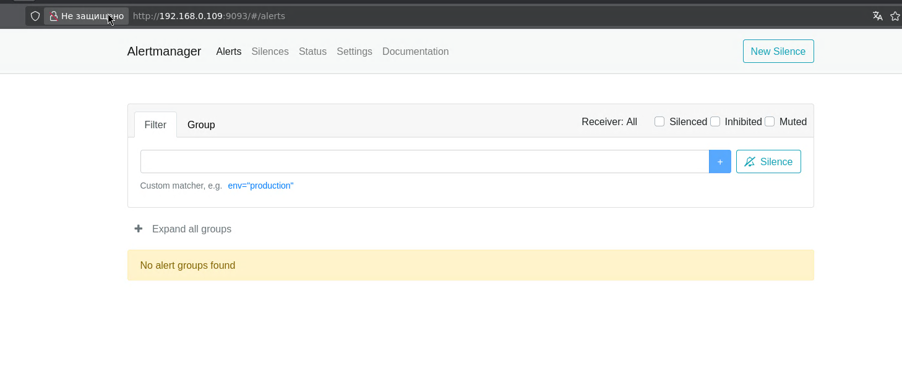
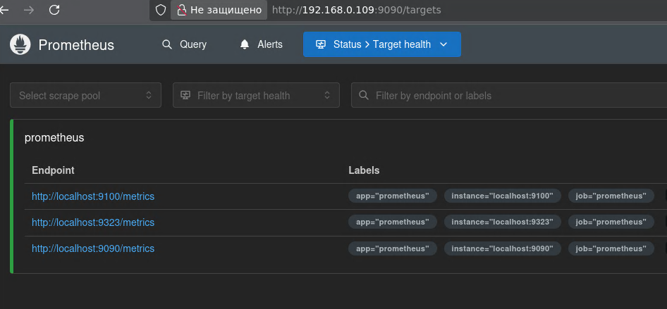
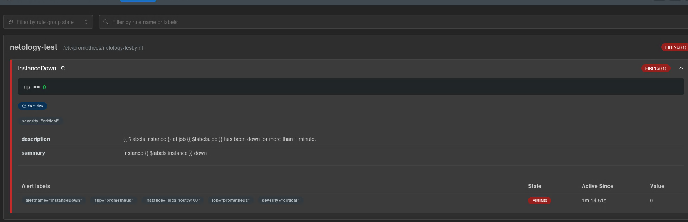
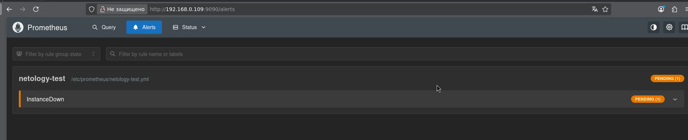
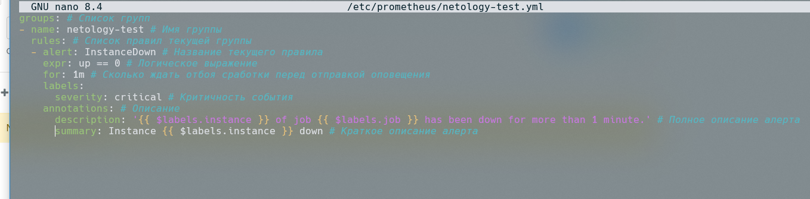
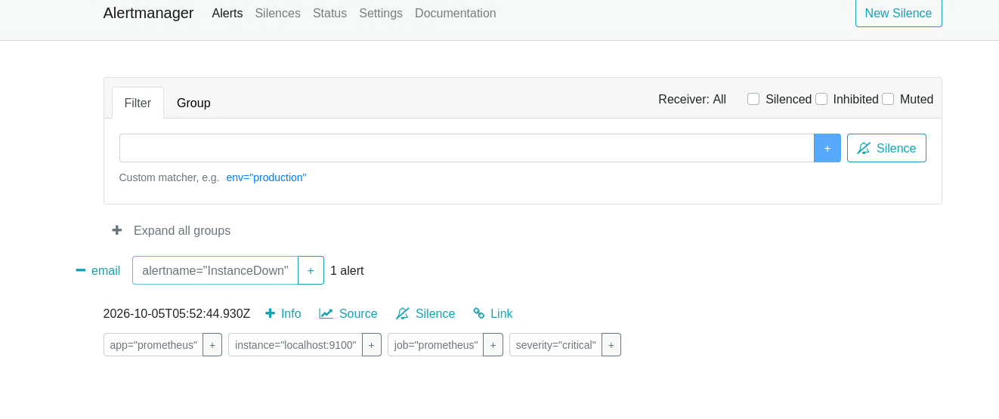
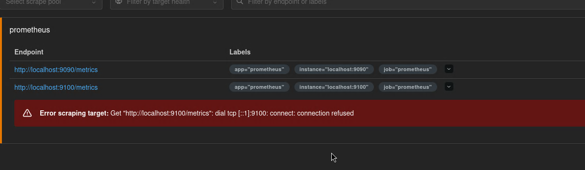
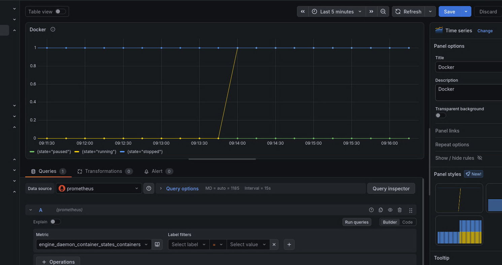

<!-- Copy and paste the converted output. -->

<!-----

You have some errors, warnings, or alerts. If you are using reckless mode, turn it off to see useful information and inline alerts.
* ERRORs: 0
* WARNINGs: 0
* ALERTS: 9

Conversion time: 3.001 seconds.


Using this Markdown file:

1. Paste this output into your source file.
2. See the notes and action items below regarding this conversion run.
3. Check the rendered output (headings, lists, code blocks, tables) for proper
   formatting and use a linkchecker before you publish this page.

Conversion notes:

* Docs™ to Markdown version 2.0β2
* Mon Oct 05 2026 19:44:06 GMT-0700 (Тихоокеанское летнее время)
* Source doc: Prometheus2
* Tables are currently converted to HTML tables.
* This document has images: check for >>>>>  gd2md-html alert:  inline image link in generated source and store images to your server. NOTE: Images in exported zip file from Google Docs may not appear in  the same order as they do in your doc. Please check the images!

----->


<p style="color: red; font-weight: bold">>>>>>  gd2md-html alert:  ERRORs: 0; WARNINGs: 0; ALERTS: 9.</p>
<ul style="color: red; font-weight: bold"><li>See top comment block for details on ERRORs and WARNINGs. <li>In the converted Markdown or HTML, search for inline alerts that start with >>>>>  gd2md-html alert:  for specific instances that need correction.</ul>

<p style="color: red; font-weight: bold">Links to alert messages:</p><a href="#gdcalert1">alert1</a>
<a href="#gdcalert2">alert2</a>
<a href="#gdcalert3">alert3</a>
<a href="#gdcalert4">alert4</a>
<a href="#gdcalert5">alert5</a>
<a href="#gdcalert6">alert6</a>
<a href="#gdcalert7">alert7</a>
<a href="#gdcalert8">alert8</a>
<a href="#gdcalert9">alert9</a>

<p style="color: red; font-weight: bold">>>>>> PLEASE check and correct alert issues and delete this message and the inline alerts.<hr></p>


**Задание 1**

Создайте файл с правилом оповещения, как в лекции, и добавьте его в конфиг Prometheus.

 Погасите node exporter, стоящий на мониторинге, и прикрепите скриншот раздела оповещений Prometheus, где оповещение будет в статусе Pending


<p id="gdcalert1" ><span style="color: red; font-weight: bold">>>>>>  gd2md-html alert: inline image link here (to images/image1.png). Store image on your image server and adjust path/filename/extension if necessary. </span><br>(<a href="#">Back to top</a>)(<a href="#gdcalert2">Next alert</a>)<br><span style="color: red; font-weight: bold">>>>>> </span></p>





**Задание 2**

Установите Alertmanager и интегрируйте его с Prometheus.

Прикрепите скриншот Alerts из Prometheus, где правило оповещения будет в статусе Fireing, и скриншот из Alertmanager, где будет видно действующее правило оповещения

*Установка:*

wget [https://github.com/prometheus/alertmanager/releases/download/v0.34.1/alertmanager-0.34.1.linux-amd64.tar.gz](https://github.com/prometheus/alertmanager/releases/download/v0.34.1/alertmanager-0.34.1.linux-amd64.tar.gz)

tar -xvf alertmanager-0.34.1.linux-amd64.tar.gz

cd alertmanager-0.34.1.linux-amd64/

sudo cp alertmanager /usr/local/bin

sudo cp amtool /usr/local/bin

sudo cp alertmanager.yml /etc/prometheus/

sudo chown prometheus:prometheus /etc/prometheus/alertmanager.yml

sudo nano /etc/systemd/system/prometheus-alertmanager.service


```
[Unit]
Description=Alertmanager Service
After=network.target

[Service]
EnvironmentFile=-/etc/default/alertmanager
User=prometheus
Group=prometheus
Type=simple
ExecStart=/usr/local/bin/alertmanager --config.file=/etc/prometheus/alertmanager.yml
--storage.path=/var/lib/prometheus/alertmanager $ARGS
ExecReload=/bin/kill -HUP $MAINPID
Restart=on-failure

[Install]
WantedBy=multi-user.target
```


sudo mkdir  /var/lib/prometheus/alertmanager

sudo chown -R prometheus:prometheus  /var/lib/prometheus/alertmanager

sudo systemctl start prometheus-alertmanager.service

sudo nano /etc/prometheus/prometheus.yml


<p id="gdcalert2" ><span style="color: red; font-weight: bold">>>>>>  gd2md-html alert: inline image link here (to images/image2.png). Store image on your image server and adjust path/filename/extension if necessary. </span><br>(<a href="#">Back to top</a>)(<a href="#gdcalert3">Next alert</a>)<br><span style="color: red; font-weight: bold">>>>>> </span></p>





```
# my global config
global:
  scrape_interval: 15s # Set the scrape interval to every 15 seconds. Default is every 1 minute.
  evaluation_interval: 15s # Evaluate rules every 15 seconds. The default is every 1 minute.
  # scrape_timeout is set to the global default (10s).

# Alertmanager configuration
alerting:
  alertmanagers:
    - static_configs:
        - targets:
           - localhost:9093

# Load rules once and periodically evaluate them according to the global 'evaluation_interval'.
rule_files:
  # - "first_rules.yml"
  # - "second_rules.yml"

# A scrape configuration containing exactly one endpoint to scrape:
# Here it's Prometheus itself.
scrape_configs:
  # The job name is added as a label `job=<job_name>` to any timeseries scraped from this config.
  - job_name: "prometheus"

    # metrics_path defaults to '/metrics'
    # scheme defaults to 'http'.

```


sudo systemctl restart prometheus 

*Создание правила оповещения:*

sudo nano /etc/prometheus/netology-test.yml


```
groups: # Список групп
- name: netology-test # Имя группы
rules: # Список правил текущей группы
- alert: InstanceDown # Название текущего правила
expr: up == 0 # Логическое выражение
for: 1m # Сколько ждать отбоя сработки перед отправкой оповещения
labels:
severity: critical # Критичность события
annotations: # Описание
description: '{{ $labels.instance }} of job {{ $labels.job }} has been down for more than 1 minute.' # Полное описание алерта
summary: Instance {{ $labels.instance }} down # Краткое описание алерта

```


<p id="gdcalert3" ><span style="color: red; font-weight: bold">>>>>>  gd2md-html alert: inline image link here (to images/image3.png). Store image on your image server and adjust path/filename/extension if necessary. </span><br>(<a href="#">Back to top</a>)(<a href="#gdcalert4">Next alert</a>)<br><span style="color: red; font-weight: bold">>>>>> </span></p>





sudo systemctl restart prometheus

sudo nano /etc/prometheus/alertmanager.yml 


```
global:
route:
  group_by: ['alertname'] # Параметр группировки оповещений — по имени
  group_wait: 30s # Сколько ждать восстановления, перед тем как отправить первое оповещение
  group_interval: 10m # Сколько ждать, перед тем как дослать оповещение о новых сработках по текущему алерту
  repeat_interval: 60m # Сколько ждать, перед тем как отправить повторное оповещение
  receiver: 'email' # Способ, которым будет доставляться текущее оповещение
receivers: # Настройка способов оповещения
- name: 'email'
  email_configs:
  - to: 'yourmailto@todomain.com'
    from: 'yourmailfrom@fromdomain.com'
    smarthost: 'mailserver:25'
    auth_username: 'user'
    auth_identity: 'user'
    auth_password: 'paS$w0rd'
```


<p id="gdcalert4" ><span style="color: red; font-weight: bold">>>>>>  gd2md-html alert: inline image link here (to images/image4.png). Store image on your image server and adjust path/filename/extension if necessary. </span><br>(<a href="#">Back to top</a>)(<a href="#gdcalert5">Next alert</a>)<br><span style="color: red; font-weight: bold">>>>>> </span></p>





<p id="gdcalert5" ><span style="color: red; font-weight: bold">>>>>>  gd2md-html alert: inline image link here (to images/image5.png). Store image on your image server and adjust path/filename/extension if necessary. </span><br>(<a href="#">Back to top</a>)(<a href="#gdcalert6">Next alert</a>)<br><span style="color: red; font-weight: bold">>>>>> </span></p>





<p id="gdcalert6" ><span style="color: red; font-weight: bold">>>>>>  gd2md-html alert: inline image link here (to images/image6.png). Store image on your image server and adjust path/filename/extension if necessary. </span><br>(<a href="#">Back to top</a>)(<a href="#gdcalert7">Next alert</a>)<br><span style="color: red; font-weight: bold">>>>>> </span></p>





<p id="gdcalert7" ><span style="color: red; font-weight: bold">>>>>>  gd2md-html alert: inline image link here (to images/image7.png). Store image on your image server and adjust path/filename/extension if necessary. </span><br>(<a href="#">Back to top</a>)(<a href="#gdcalert8">Next alert</a>)<br><span style="color: red; font-weight: bold">>>>>> </span></p>





**Задание 3**

Активируйте экспортёр метрик в Docker и подключите его к Prometheus.

приложите скриншот браузера с открытым эндпоинтом, а также скриншот списка таргетов из интерфейса Prometheus.*

**Docker**

sudo nano /etc/docker/daemon.json


```
{
 "metrics-addr" : "0.0.0.0:9323",
 "experimental" : true
}

```


<p id="gdcalert8" ><span style="color: red; font-weight: bold">>>>>>  gd2md-html alert: inline image link here (to images/image8.png). Store image on your image server and adjust path/filename/extension if necessary. </span><br>(<a href="#">Back to top</a>)(<a href="#gdcalert9">Next alert</a>)<br><span style="color: red; font-weight: bold">>>>>> </span></p>





sudo nano /etc/prometheus/prometheus.yml


```
# my global config
global:
  scrape_interval: 15s # Set the scrape interval to every 15 seconds. Default is every 1 minute.
  evaluation_interval: 15s # Evaluate rules every 15 seconds. The default is every 1 minute.
  # scrape_timeout is set to the global default (10s).

# Alertmanager configuration
alerting:
  alertmanagers:
    - static_configs:
        - targets:
           - localhost:9093

# Load rules once and periodically evaluate them according to the global 'evaluation_interval'.
rule_files:
  - "netology-test.yml"
  # - "first_rules.yml"
  # - "second_rules.yml"

# A scrape configuration containing exactly one endpoint to scrape:
# Here it's Prometheus itself.
scrape_configs:
  # The job name is added as a label `job=<job_name>` to any timeseries scraped from this config.
  - job_name: "prometheus"

    # metrics_path defaults to '/metrics'
    # scheme defaults to 'http'.

    static_configs:
      - targets: ["localhost:9090", "localhost:9100", "localhost:9323"]
       # The label name is added as a label `label_name=<label_value>` to any timeseries scraped from this config.
        labels:
          app: "prometheus"
    scrape_native_histograms: true
```


**Задание 4* **

Создайте свой дашборд Grafana с различными метриками Docker и сервера, на котором он стоит.


<p id="gdcalert9" ><span style="color: red; font-weight: bold">>>>>>  gd2md-html alert: inline image link here (to images/image9.png). Store image on your image server and adjust path/filename/extension if necessary. </span><br>(<a href="#">Back to top</a>)(<a href="#gdcalert10">Next alert</a>)<br><span style="color: red; font-weight: bold">>>>>> </span></p>


Встроенный механизм Docker Engine Daemon (активируется через параметр metrics-addr в daemon.json) собирает метрики не о внутренних процессах конкретного контейнера, а о здоровье и работе самого движка Docker и его внутренних компонентов.

engine_daemon_container_states_containers — Показывает количество контейнеров, сгруппированных по их текущему состоянию (state="running", "paused", "stopped"). 

cAdvisor (Container Advisor) — это инструмент с открытым исходным кодом от компании Google, который собирает, обрабатывает и экспортирует метрики использования ресурсов и производительности запущенных контейнеров 


* container_cpu_usage_seconds_total - Использование CPU 
* container_memory_usage_bytes - Потребление оперативной памяти 


* 
container_memory_working_set_bytes  - Использование лимита памяти Рабочий набор памяти — важнейший показатель, по которому Docker принимает решение о завершении процесса при нехватке памяти (OOM Killer).
Объем полученных и переданных сетевых данных:


* container_network_receive_bytes_total 
* container_network_transmit_bytes_total 

Дисковый ввод-вывод:


* container_fs_reads_bytes_total 
* container_fs_writes_bytes_total 